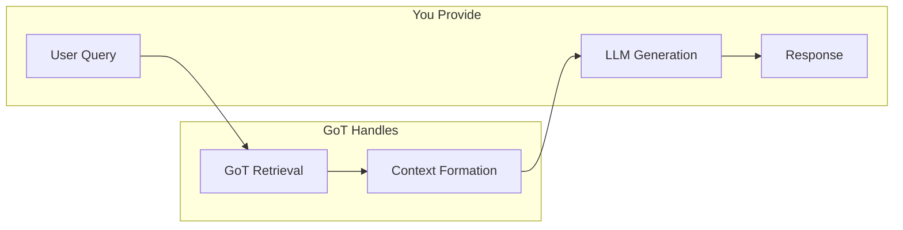

# Graph-of-Thought Examples

**All examples work without any API keys!**

## RAG System Integration

Graph-of-Thought is designed to enhance the **retrieval component** of RAG systems. It replaces traditional vector-based retrieval with intelligent document structure understanding.

### How GoT Fits in RAG Architecture



## Examples

### basic-usage.ts
Simple demonstration of indexing and retrieval - no external dependencies.

```bash
npx ts-node examples/basic-usage.ts
```

### rag-integration.ts
Shows how to integrate Graph-of-Thought into an existing RAG system.

```bash
npx ts-node examples/rag-integration.ts
```

### serialize-trees.ts
Demonstrates saving and loading tree indexes for persistence.

```bash
npx ts-node examples/serialize-trees.ts
```

## Setup

1. Install dependencies:
```bash
cd graph-of-thought
npm install
```

2. Run an example:
```bash
npx ts-node examples/basic-usage.ts
```

**No API keys needed!**

## Basic Pattern

```typescript
import { GraphOfThought } from 'graph-of-thought';

// 1. Create instance (no config needed)
const got = new GraphOfThought();

// 2. Index your document
const index = await got.index(content, 'Title');

// 3. Retrieve relevant content
const result = await got.retrieve(index, 'Your query');

// 4. Use the context in your application
console.log(result.context);
```

## RAG Integration Pattern

```typescript
// In your existing RAG system
class MyRAG {
  private got = new GraphOfThought();
  private indexes = new Map();
  
  async addDocument(content, name) {
    const index = await this.got.index(content, name);
    this.indexes.set(name, index);
  }
  
  async getContext(query) {
    const contexts = [];
    for (const index of this.indexes.values()) {
      const result = await this.got.retrieve(index, query);
      contexts.push(result.context);
    }
    return contexts.join('\n\n');
  }
  
  // Your LLM integration here
  async query(question) {
    const context = await this.getContext(question);
    // Pass context to your LLM
    return await yourLLM.generate(context, question);
  }
}
```

## Key Benefits for RAG Systems

1. **Better Context**: Understands document relationships and cross-references
2. **Zero Setup**: No vector databases or API keys required
3. **Efficient Processing**: Only activates relevant document sections (20-40% of nodes typically)
4. **Scalable**: Handles complex documents with intelligent traversal
5. **Flexible**: Works with any LLM provider you choose
6. **Optimized Retrieval**: Tree-like activation patterns within graph structure

## Performance Optimization

The library includes selective node activation that provides significant performance improvements:

```typescript
// Enable optimized mode (default)
const got = new GraphOfThought({ debug: true });

// For large documents, optimized mode can be 2-3x faster
const result = await got.retrieve(index, 'complex query');
console.log(`Nodes activated: ${result.activationStats?.activated}/${result.activationStats?.total}`);
```

The examples demonstrate how GoT enhances your existing RAG pipeline by providing smarter, more contextually relevant retrieval without replacing your LLM components.
